# Visual Studio Code Development

This describes how to development C++ applications in the MLTK using Microsoft [Visual Studio Code](https://code.visualstudio.com).  
Using this guide, you can build C++ applications for Windows/Linux or supported embedded platforms.

__NOTES:__  
- All of the MLTK C++ source code may be found at: [__mltk repo__/cpp](../../cpp)
- Internally, VSCode uses CMake to build the applications
- Refer to the [example applications](./examples/index.md) or [Python wrappers](./wrappers/index.md) documentation for more details about what comes with the MLTK
- Alternatively, applications may be built for Silicon Lab's embedded targets using [Simplicity Studio](./simplicity_studio.md)


## Install Tools

First, we need to install a few tools:


### 1) Install CMake

CMake is a build system utility used to build the C++ applications.  
Install CMake and ensure it is available on the command `PATH`  
More details here: [https://cmake.org/install](https://cmake.org/install)


### 2) Install 7-Zip

7-Zip is a file archiver with a high compression ratio.  
Several of the assets downloaded by the MLTK are compressed in this format.  
More details here: [https://www.7-zip.org/download.html](https://www.7-zip.org/download.html)


### 3) Install Python

Install Python 3.7, 3.8, _or_ 3.9 64-bit and ensure it is available on the command `PATH`  
More details here: [https://www.python.org/downloads](https://www.python.org/downloads)


### 4) Install Segger GDB Debug Server

While not required, this is used to single-step debug an embedded development board.  
If you're only build for Window/Linux then you can skip this step.

Download and install the J-Link Software Pack:  
[https://www.segger.com/downloads/jlink/#J-LinkSoftwareAndDocumentationPack](https://www.segger.com/downloads/jlink/#J-LinkSoftwareAndDocumentationPack)

If using Windows, select the 64-bit installer:  
[https://www.segger.com/downloads/jlink/JLink_Windows_x86_64.exe](https://www.segger.com/downloads/jlink/JLink_Windows_x86_64.exe)


### 5) Install a Serial Terminal

While not required, this is used to view the serial logs from an embedded development board.
If you're only build for Window/Linux then you can skip this step.

For Windows, [TeraTerm](https://osdn.net/projects/ttssh2/releases/) is a free serial terminal.


### 6) Install GIT

If necessary, install Git:  
[https://git-scm.com/downloads](https://git-scm.com/downloads)


### 7) Windows: Install the C++ Redistributable Package

If you're using Windows, install the [Microsoft Visual C++ Redistributable for Visual Studio 2015, 2017 and 2019](https://support.microsoft.com/en-us/help/2977003/the-latest-supported-visual-c-downloads)
which is required by [Tensorflow](https://www.tensorflow.org/install/pip)


## Install MLTK

Next, we need to install the MLTK:


### 1) Clone the MLTK repository


```shell
# Clone the MLTK GIT repository
git clone https://github.com/siliconlabs/mltk.git
```

Then navigate to the MLTK repository directory

```shell
cd mltk
```

### 2) Run the install script

```{eval-rst}
.. tabbed:: Windows

   .. code-block:: shell

      python .\install_mltk.py

.. tabbed:: Linux

   .. code-block:: shell

      python3 ./install_mltk.py
```

### 3) Activate the MLTK Python virtual environment

Activate the MLTK's Python virtual environment:

```{eval-rst}
.. tabbed:: Windows

   .. code-block:: shell

      .\.venv\Scripts\activate.bat

.. tabbed:: Linux

   .. code-block:: shell

      source ./.venv/bin/activate
```

After activation, the `mltk` command should be available on the [command-line](../command_line.md):

```shell
mltk --help
```


## VSCode Setup

With the MLTK installed, let's get [Visual Studio Code](https://code.visualstudio.com) setup.


### 1) Install VSCode

Download and install [Visual Studio Code](https://code.visualstudio.com)


### 2) Open the MLTK VSCode workspace

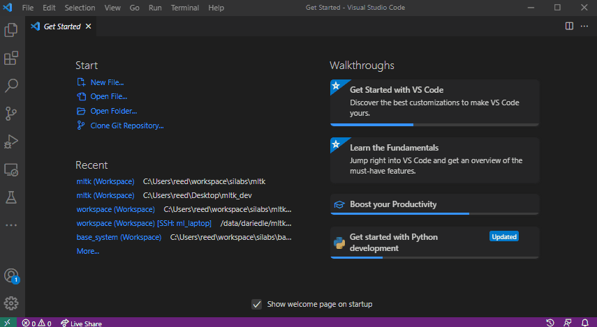


### 3) Install the recommended extensions

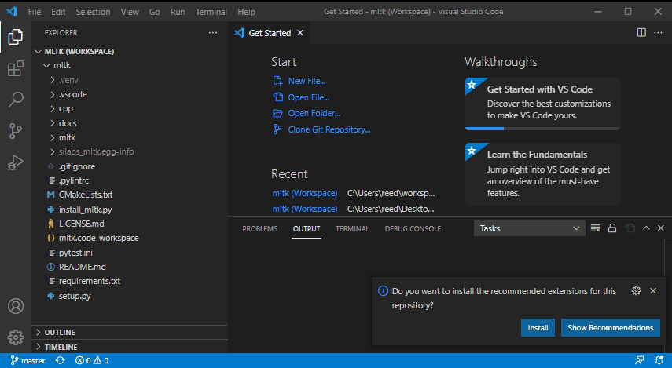

__OR__

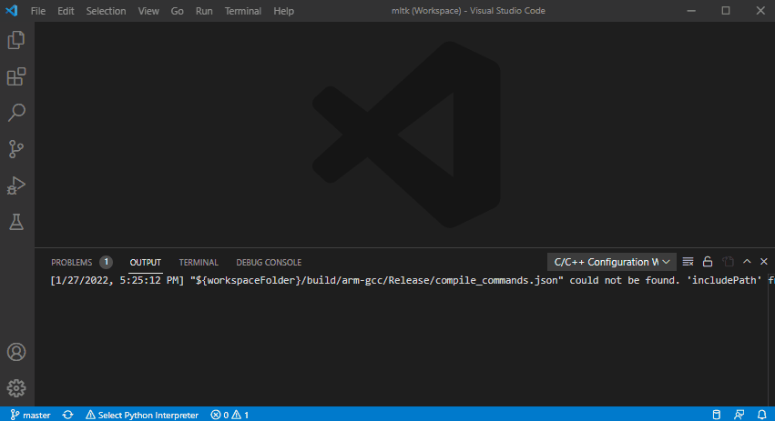


### 4) Select the Python Interpreter

Select the MLTK virtual environment's Python interpreter.

It has the similar to:  
```shell
<mltk dir>\.venv\Scripts\python.exe    <-- Windows
<mltk dir>/.venv/bin/python3           <--- Linux
```

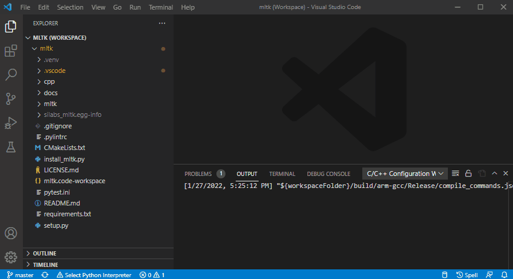

 

## Build for Windows or Linux

Many of the MLTK [applications](../../cpp/shared/apps) support running on Windows/Linux or embedded targets.  
The following describes how to build for Windows/Linux.


### 1) Optionally create file: user_options.cmake

Optionally create the file: `<mltk repo root>/user_options.cmake`

And add any build specific settings.
Refer to the [Build Options](./build_options.md) for more details on the available settings.


### 2) Select the CMake Kit

Based on your host OS, select one of the following CMake kits:  
- `MLTK-Windows-GCC`
- `MLTK-Linux-GCC` 

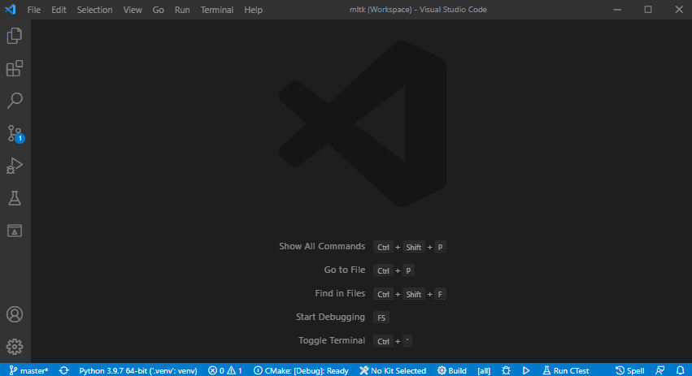


### 3) Configure the CMake Project

Configure the CMake project (this may take awhile):

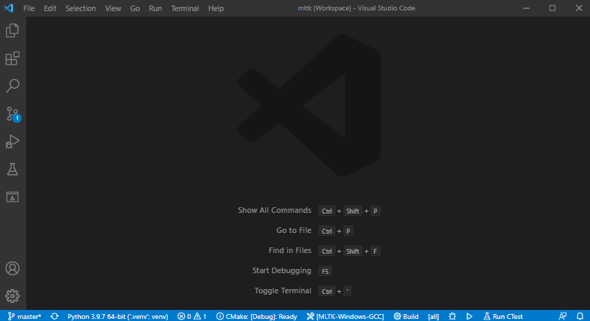


### 4) Select the build type and build target

Select the CMake build type, the build target, then build the application.

In this example, we build the __mltk_hello_world__ application in __release__ mode:

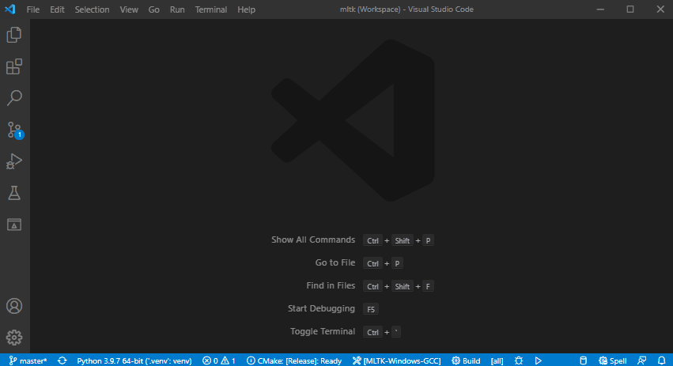


### 5) Build and run application

This shows how to:
- Build as __release__
- __Run__ the `mltk_hello_world` application:

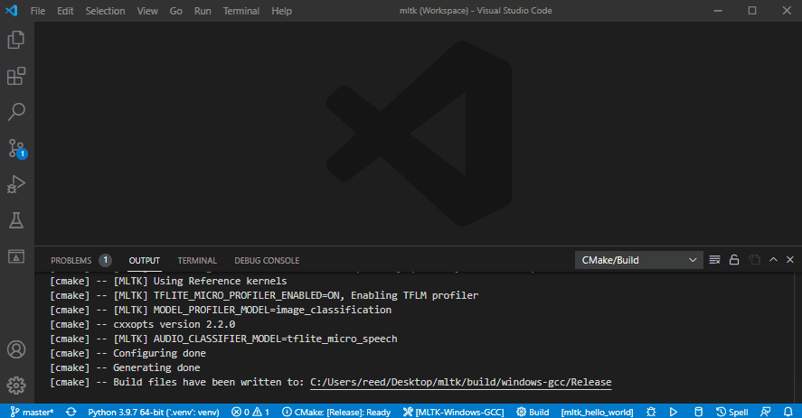


### 6) Or debug application

Alternatively, you can build as __debug__ and single-step debug the application.  
This shows how to:
- Set a __breakpoint__ 
- Build as __debug__
- __Debug__ the `mltk_model_profiler` application

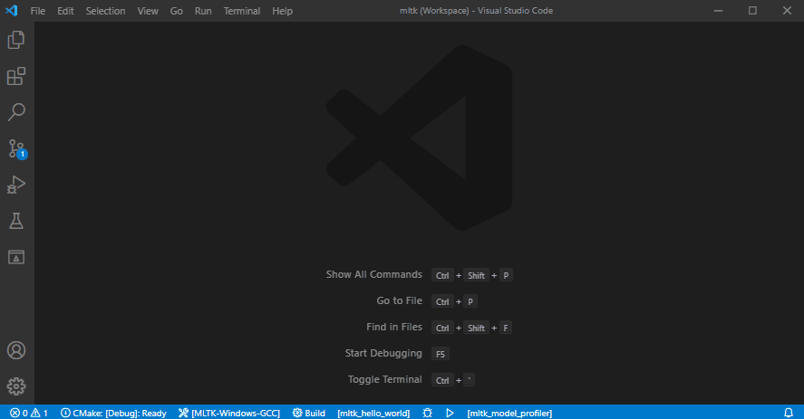


## Build for embedded

The MLTK also supports building and running/debugging applications on supported development boards.


### 0) Configure Serial Terminal

A serial terminal is needed to view the logs generated by the development board.  
For Windows, [TeraTerm](https://osdn.net/projects/ttssh2/releases/) is a free serial terminal.

First, connect your dev board via USB.

Then, open the serial terminal program and select the `COM Port` that has a description
similar to: `J-Link CDC Uart` and set the `Speed` (aka BAUD Rate) to `115200`:

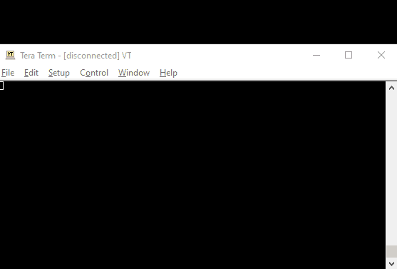


### 1) Create file: user_options.cmake

Create the file: `<mltk repo root>/user_options.cmake`

And add the following to it:

```
mltk_set(MLTK_PLATFORM_NAME brd2601)
```

This creates a CMake variable and tells the build system to use the `brd2601` platform.  
The supported platforms may be found at: [__mltk repo__/cpp/shared/platforms](../../cpp/shared/platforms)

__NOTE:__ If this variable is not defined, then the host operating system (e.g. `windows` or `linux`) is automatically selected.

Refer to the [Build Options](./build_options.md) for more details on the available settings.


### 2) Select the MLTK-ARM-GCC CMake Kit

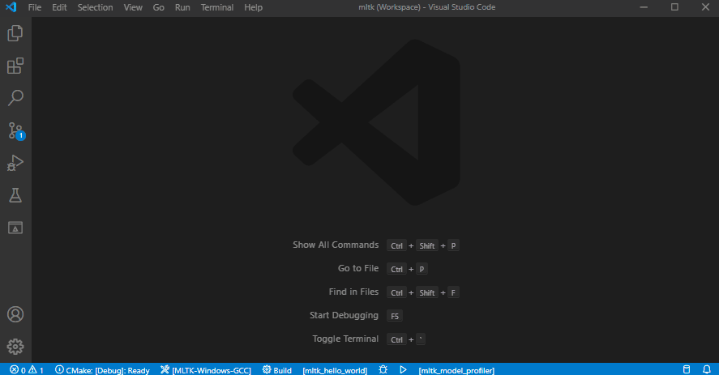


### 3) Configure the CMake Project

Configure the CMake project (this may take awhile):


### 4) Select the build type and build target

Select the CMake build type, the build target, then build the application.

In this example, we build the __mltk_hello_world__ application in __release__ mode:

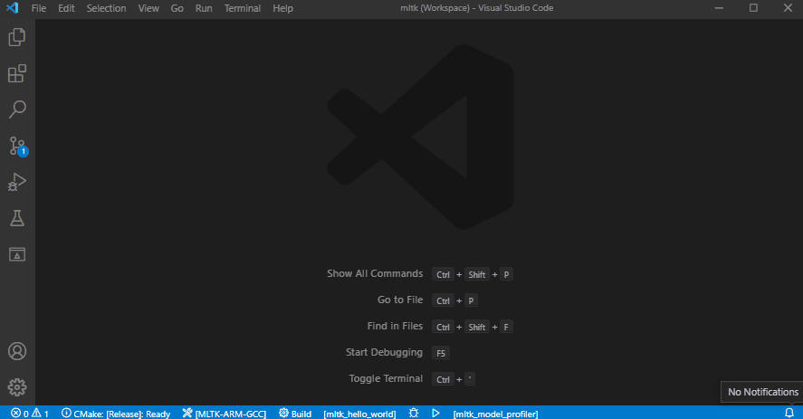


### 5) Build, download, and run application


The `hello_world` MLTK application has three "targets":
- `mltk_hello_world` - Build the application
- `mltk_hello_world_download` - Build the application and download it to the development board
- `mltk_hello_world_reset` - Reset the development board

Other applications have similar targets, e.g.:
- `mltk_model_profiler`
- `mltk_model_profiler_download`
- `mltk_model_profiler_reset`

__NOTES:__  
- A supported development board must be connected via USB
- You must have [Segger J-Link](https://www.segger.com/downloads/jlink/#J-LinkSoftwareAndDocumentationPack) installed (see the [Install Tools](#install-tools) section)
and also a serial terminal to view the logs generated by the development board.

This shows how to:
- Build as __release__
- __Download__ to the embedded development board
- __Run__ the `mltk_hello_world` application


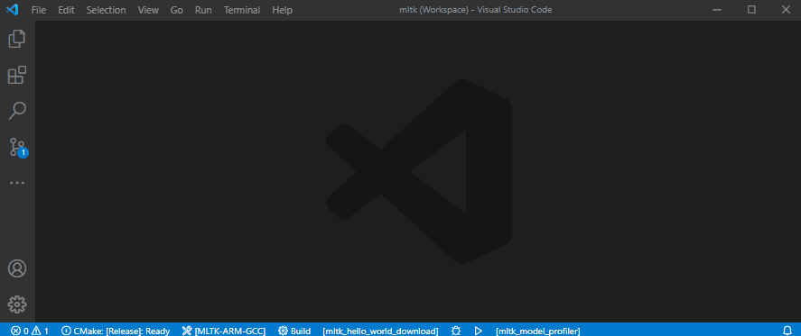


### 6) Build, download, and debug application

__NOTES:__  
- A supported development board must be connected via USB
- You must have [Segger J-Link](https://www.segger.com/downloads/jlink/#J-LinkSoftwareAndDocumentationPack) installed (see the [Install Tools](#install-tools) section)
and also a serial terminal to view the logs generated by the development board.

This shows how to:
- Build as __debug__
- Set a __breakpoint__
- __Download__ to the embedded development board
- __Debug__ the `mltk_model_profiler` application


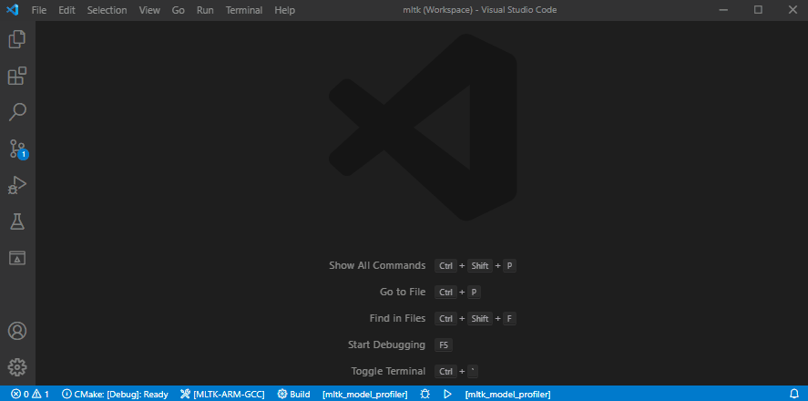


## Example Applications

Refer to the [Examples](./examples/index.md) documentation for more details about the applications that come with the MLTK.

## Python Wrappers

Refer to the [Python wrappers](./wrappers/index.md) documentation for more details about the wrappers that come with the MLTK.