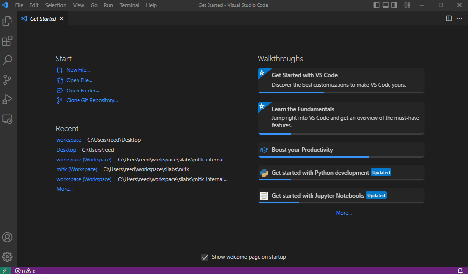

# How can I debug my model during training?

The model is defined in a [model specification](../guides/model_specification.md) file which is a standard Python script.  
This script is loaded by the MLTK [train](../guides/model_training.md) command.

Using [Visual Studio Code](https://code.visualstudio.com/docs/editor/debugging) you can single-step debug your model during model training.

1. If necessary, [install](../installation.md) the MLTK
2. Install [Visual Studio Code](https://code.visualstudio.com/)
3. Open VSCode, and install the [Python VScode extension](https://code.visualstudio.com/docs/languages/python)
4. From VSCode select `File` on the top-right, then `Open Folder` and open the folder containing your model's Python script
5. From VSCode, open your model Python script and set a breakpoint
6. [Configure](https://code.visualstudio.com/docs/languages/python#_environments) the VSCode Python interpreter to point the one with the MLTK installed 
    If you created a virtual environment for the MLTK, then you should select that Python interpreter,  
    e.g. `./mltk_pyvenv/Scripts/python.exe`

7. From VSCode, select the `Run and Debug` tab, then the `create a launch.json` link,
8. To `.vscode/launch.json`, add:
    
    ```json
    {
      "version": "0.2.0",
      "configurations": [
        {
          "name": "Python: train",
          "type": "python",
          "request": "launch",
          "module": "mltk",
          "args": [
            "train",
            "--test",
            "my_model.py"
          ]
        }
      ]
    }
    ```

    This defines a new Python [launch configuration](https://code.visualstudio.com/docs/editor/debugging#_launch-configurations) which effectively runs the command:

    ```shell
    cd <folder containing your model>
    mltk train --test ./my_model.py
    ```
    However, with this, we can set breakpoints and single-step through the code.
9.  [Launch](https://code.visualstudio.com/docs/editor/debugging#_start-debugging) the `Python: train` debug configuration to debug your script




```{note}
Any of the other mltk [commands](../command_line/index.md) can be debugged in a similar manner, just update the `args` in the `.vscode/launch.json` configuration. 
```

```{note}
If you to debug the data generator callbacks, be sure to set the `debug` option first, e.g.:  
```python
my_model.datagen = ParallelAudioDataGenerator(
  debug=True, # Set this to true to enable debugging of the generator
  ...
```
```