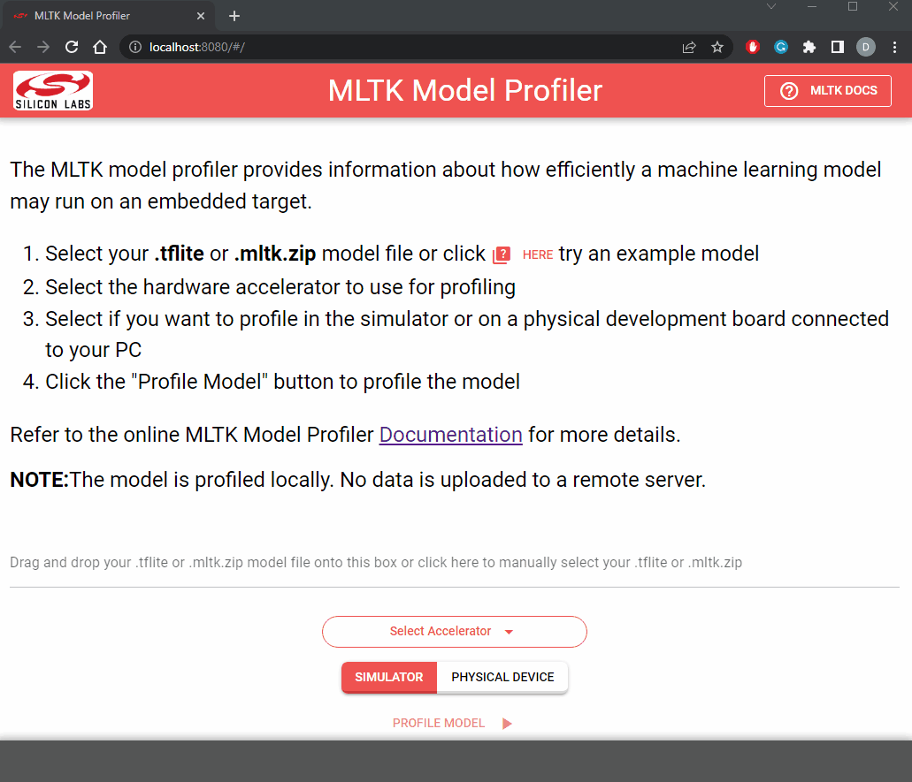
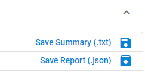

# Model Profiler Utility

The model profiler utility effectively wraps the [Model Profiler](./model_profiler.md)
that comes with the MLTK into a standalone executable with a webpage interface.
It allows for profiling `.tflite` formatted models in a simulator _or_ on a locally connected 
embedded target.  
__No installation required__.

```{note}
- _All_ model profiling is done locally. _No_ data is uploaded to a remote server
- Simulated numbers are based on the __EFR32xG24__
```

## Download

The model profile utility may be downloaded from here:  
- [Windows](https://www.dropbox.com/s/acz22zktqdet9ww/mltk_model_profiler.exe?dl=1)
- [Linux](https://www.dropbox.com/s/0vm9zrl4rg2gioy/mltk_model_profiler?dl=1)


## Usage

To use the model profiler utility:

1. __Download__ the executable from the link above  
2. After downloading, __download-click__ the executable
3. The executable will:  
   1 ) Start a local HTTP server on `http://localhost:8080`
   2 ) Open a webpage in your default browser
4. From the webpage, __drag and drop__ your `.tflite` _or_ `.mltk.zip` model file onto the box
5. Select the hardware __accelerator__ to use for profiling
6. Select whether you want to profile using the __simulator__ or locally connected embedded __device__
7. Click the __Profile Model__ button

This will profile the given model then display the results.  
Refer to the [Model Profiler](./model_profiler.md) guide for more details on the displayed profiling results.




## Saving the results

After profiling completes, you can save the results in JSON or text format by clicking the respective button on the top-right:




## Local HTTP server options

The profiler webpage is served from a local HTTP server.  
By default, the server starts on `localhost:8080`.

The host and port may be changed by specifying the command line options:

```shell
mltk_model_profiler [--host <host>] [--port <port>]
```

Where:  
- `<host>` is the local network host interface IP address, e.g. `192.168.1.4`
- `<port`> is the HTTP server listening port, e.g. `8000`


