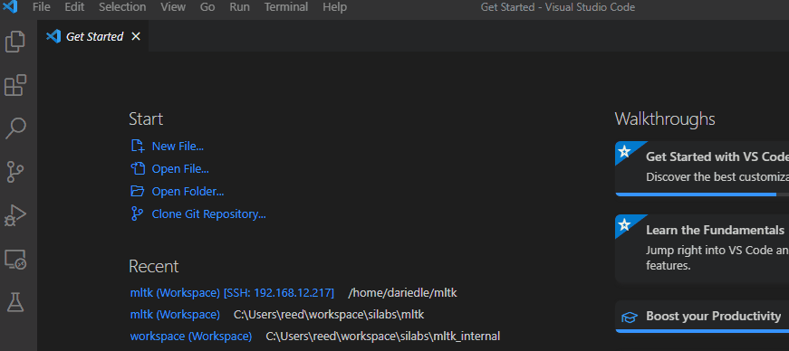
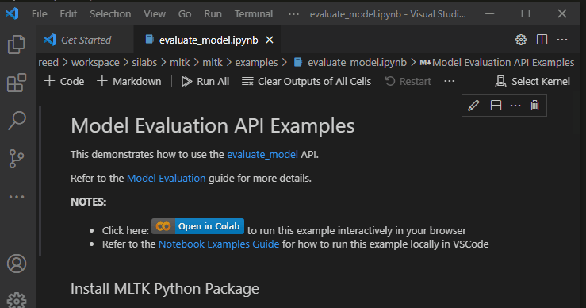
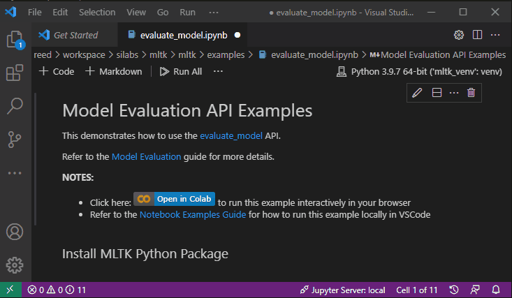
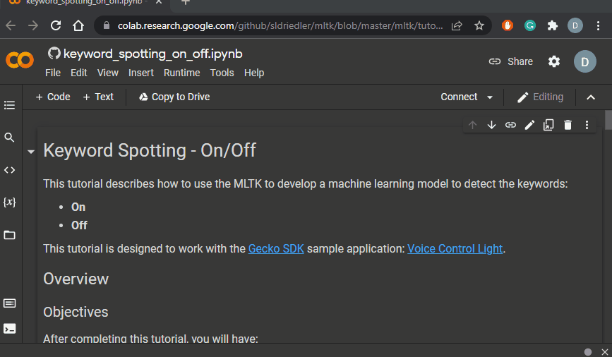

# Notebook Examples Guide

The MLTK [Tutorials](../tutorials.md) and [API Examples](../examples.md) are implemented in a [Jupyter Notebooks](https://jupyter.org/).
A Notebook allows for Markdown documentation with inline, executable Python code.

This describes how to run the a Notebook __locally__ in [VSCode](https://code.visualstudio.com) or __remotely__ on [Google Colab](https://colab.research.google.com/notebooks/welcome.ipynb)

## VSCode Notebooks

[VSCode](https://code.visualstudio.com) allows for running Notebooks locally on your PC.  
Refer to the official [VS Code Notebook](https://code.visualstudio.com/docs/datascience/jupyter-notebooks) documentation for getting started.

To run an MLTK example or tutorial notebook in VSCode:

1. Open [VSCode](https://code.visualstudio.com)
2. Select a Python Interpreter  
   This can be any supported Python Interpreter (Python 3.9, 3.10, 3.11, _or_ 3.12), however, it's recommended to create a
   Python "virtual environment" for installing the MLTK.  
   See the [Installation Guide](../installation.md) for more details.  
   To select the Python Interpreter open the VSCode "Command Palette" (`Ctrl+Shift+P`), and enter: __Python: Select Interpreter__  
   Then find/enter the path to the Python executable you want to use.  
   
   

3. Open an MLTK example or tutorial (file extension `.ipynb`) in VSCode
4. Press the __Select Kernel__ button on the upper-right and select the Python Interpreter from step 2 
    
   

5. Run an executable cell in the Notebook  
   The first time you run a cell, you may be prompted to __Install ipykernel__
   Click "Install" to install the package.  
   You should now be able to fully execute the examples and tutorials from the VSCode notebook environment 
   
   

## Google Colab

[Google Colab](https://colab.research.google.com/notebooks/welcome.ipynb) is a _free_ service provided by Google that allows for leveraging the Google cloud servers and GPUs for training your model.

__NOTE:__ When running on Colab, the MLTK executes on the remote Google servers. As such, some commands that require local access are not supported.

To run an MLTK example or tutorial in Colab:

1. Create a Google Account (if necessary)  
   Go to the [Google Signup](https://accounts.google.com/signup) page.  
   __NOTE:__ Click the __Use my current email address instead__ button to use your existing email instead of creating a gmail email address.
2. Select the example or tutorial you want to run, and click the  button at the top of the example or tutorial
3. At this point, you should be able to execute the example or tutorial on Colab  
   __NOTE:__ Be sure to first install the MLTK via pip `!pip install silabs-mltk`, all the examples/tutorials have this code at the top

__NOTE:__ When training a model a [Google Colab](https://colab.research.google.com/notebooks/welcome.ipynb), be sure to first select the GPU hardware accelerator:  

